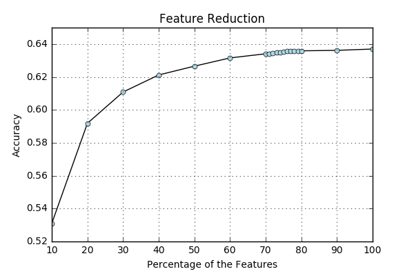
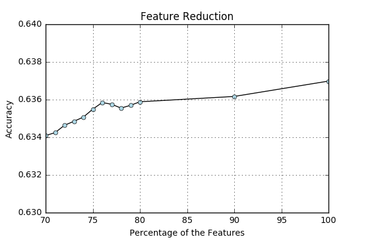

# Feature Reduction

Feature reduction is implemented to reduce running time and storage size for Questionmark. This blog update discusses how this is done.

The X and Y for training are constructed in the same method as the previous blog update. In this manner 26314 features are included in the Train and Validation set. To reduce the amount of features the SelectPercentile package from Sklearn is implemented on 10, 20, 30, 40, 50 60, 70, 80, 90 and 100. That results in the following graph. 



Because the accuracy falls from 64 to 63 in the jump from 70 to 80 this range is split in steps of 1, which results in the following graph. 



The values corresponding to these graphs are the following:

```
Accuracy Linear SVC 10: 0.53 (+/- 0.03)
Accuracy Linear SVC 20: 0.59 (+/- 0.02)
Accuracy Linear SVC 30: 0.61 (+/- 0.03)
Accuracy Linear SVC 40: 0.62 (+/- 0.02)
Accuracy Linear SVC 50: 0.63 (+/- 0.02)
Accuracy Linear SVC 60: 0.63 (+/- 0.02)
Accuracy Linear SVC 70: 0.63 (+/- 0.02)
Accuracy Linear SVC 71: 0.63 (+/- 0.02)
Accuracy Linear SVC 72: 0.63 (+/- 0.02)
Accuracy Linear SVC 73: 0.63 (+/- 0.02)
Accuracy Linear SVC 74: 0.64 (+/- 0.03)
Accuracy Linear SVC 75: 0.64 (+/- 0.03)
Accuracy Linear SVC 76: 0.64 (+/- 0.03)
Accuracy Linear SVC 77: 0.64 (+/- 0.03)
Accuracy Linear SVC 78: 0.64 (+/- 0.03)
Accuracy Linear SVC 79: 0.64 (+/- 0.03)
Accuracy Linear SVC 80: 0.64 (+/- 0.03)
Accuracy Linear SVC 90: 0.64 (+/- 0.03)
Accuracy Linear SVC 100: 0.64 (+/- 0.03)
```

SelectPercentile computes the ANOVA F-value for the provided sample, and for a better understanding of this method [Understanding Analysis of Variance (ANOVA) and the F-test](http://blog.minitab.com/blog/adventures-in-statistics-2/understanding-analysis-of-variance-anova-and-the-f-test) is a good resource. Another score function was implemented as well, [chi2](http://scikit-learn.org/stable/modules/generated/sklearn.feature_selection.chi2.html#sklearn.feature_selection.chi2), but resulted in the same accuracy scores. This might vary from dataset to dataset and I recommend trying both. 


Because 76 percent of the features results in the lowest number of features corresponding to no decrease in accuracy a gridsearch on the C parameter is run with this subset of the data. This results in an optimal value of 0.1, with a corresponding accuracy of 65 percent. The previous C value is 1.0, the default C value.   

```
0.47 (+/-0.026) for {'C': 0.001}
0.59 (+/-0.026) for {'C': 0.01}
0.65 (+/-0.029) for {'C': 0.1}
0.64 (+/-0.026) for {'C': 1}
0.59 (+/-0.028) for {'C': 10}
0.53 (+/-0.029) for {'C': 100}
```

These values are then checked with the validation set with an implemented 'bubble', which is described in the previous blog update. This bubble entails that all product nuts that have the same category are kept together in cross validation to avoid overfitting. Preforming the calculations on the validation set is done by transforming the validation set to only contain the selected features with the following code. 

```
selector = SelectPercentile(percentile=76)
selector.fit_transform(X_TRAIN, Y_TRAIN)
X_VAL = selector.transform(X_VALIDATE)
```

This results is the following micro and macro recall score. 

```
micro recall score:  0.739974311403
macro recall score:  0.600547619048
```

Furthermore some bugs were removed, such as the stopword removal after the addition of tags, which was solved by removing the tags all together. Also the stopwords were enriched with more standard Dutch stopwords. 

In conclusion the amount of features can be reduced to 76 percent of the original amount of features to keep the accuracy at 64 percent in the train set. In the validation set this results in a macro recall score of 60 percent. 

