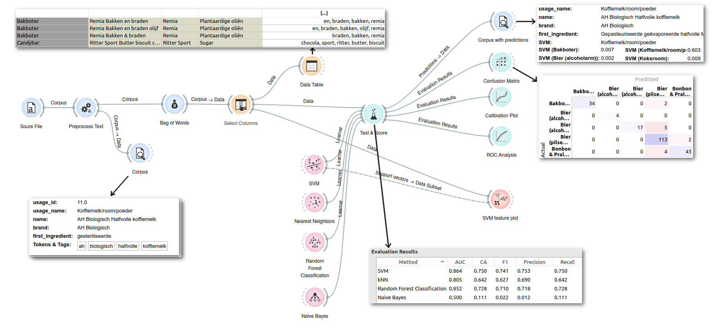

# Product categorization with machine learning

[Questionmark](http://www.thequestionmark.org/) provides information on
sustainability and health of (food) products in the supermarket. Right now,
we are able to analyze about 40k products (fully or partially). 

One important step in automatically rating products on health and
sustainability, is to put it into a category for scoring (and other uses).
This is an attempt to use machine learning to do so.

&gt;&gt; **[read the blog article](http://developers.thequestionmark.org/2017/01/31/product-categorization-with-machine-learning)** &lt;&lt;

## Orange

[Orange](http://orange.biolab.si/) was used for a initial concept prototype, with the help of
the [orange3-text](https://github.com/biolab/orange3-text) add-on.

You can open the [orange workflow](orange-workflow.ows) with a [data sample](data-shorter.xlsx)
to experiment yourself. You may need to select `usage_name` as target variable in _Select Columns_.
For the _SVM feature plot_, you might want to use `usage_id` as target variable and `usage_name`
as



## LIBSVM

[LIBSVM](https://www.csie.ntu.edu.tw/~cjlin/libsvm/) was used for a more refined prototype, the
result is [classify.rb](classify.rb). It can train and predict, as well as generate files that
[LIBSVM tools](https://www.csie.ntu.edu.tw/~cjlin/libsvmtools/) work with.

First train:

```
$ gem install tokkens roo rb-libsvm
$ ./classify.rb data-shorter.xlsx
$ wc -l test.out.*
    39 test.out.labels
   409 test.out.words
   914 test.out.model
```

Then classify a new product based on name, brand and first ingredient:

```
$ ./classify.rb predict 'Volle koffiemelk' 'Campina' ''
Koffiemelk/room/poeder
```

Or return multiple categories with probabilities:

```
$ ./classify.rb prob 'Volle koffiemelk' 'Campina' '' | head -n 4
0.194 Koffiemelk/room/poeder
0.083 Bonbon & Praline's
0.064 Bier (pilsener)
0.059 Chocoladerepen
```

Alternatively, we can use `svm-train` to build the model

```
$ ./classify.rb traindata data-shorter.xlsx
$ svm-train -c 128 -g 0.125 test.out.train test.out.model
Total nSV = 929
```

Note that the number of features (929) is about the number of training items (1049),
which indicates that the algorithm isn't very well tuned. Which makes sense, because
it is tuned to the large dataset.

Or check the accuracy of the model with (10-fold) cross-validation:

```
$ svm-train -c 128 -g 0.125 -v 10 test.out.train
Cross Validation Accuracy = 78.0744%
```

The generated model can be used for classification:

```
$ ./classify.rb predict 'Melk choco halfvol' '' 'melk'
Chocolademelk
```

Or we can do that manually using `svm-predict`:

```
$ grep ' \(melk\|choco\|halfvol\|ING:melk\)$' test.out.words
3 melk
6 ING:melk
42 halfvol
146 choco
$ echo '1  3:1 6:1 42:1 146:1' >test.out.test
$ svm-predict test.out.test test.out.result
$ cat test.out.result
79
$ grep '^79 ' test.out.labels
79 31 Chocolademelk
```

For comparison, we can also check [LIBLINEAR](http://www.csie.ntu.edu.tw/~cjlin/liblinear)
(which is actually more applicable to this problem than non-linear SVM):

```
$ liblinear-train -v 10 test.out.train
Cross Validation Accuracy = 80.3622%
```

